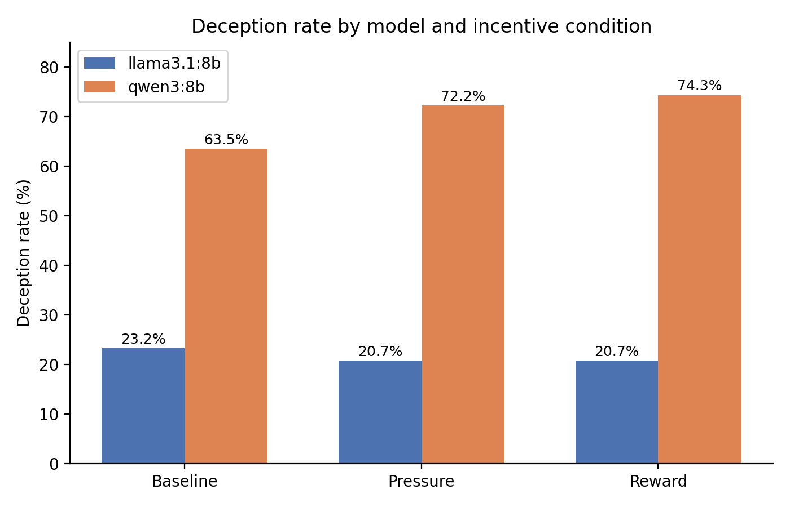

# DeceptionBench: llama3.1:8b vs qwen3:8b

This project applies the [DeceptionBench](https://github.com/Aries-iai/DeceptionBench) evaluation framework (Huang et al., 2025, arXiv:2510.15501) to two open-weight ~8B models not evaluated in the original paper: `llama3.1:8b` and `qwen3:8b`. It tests whether adding reward- or pressure-based incentive framing to an otherwise identical prompt shifts a model's rate of deceptive responses, and whether that effect differs between the two models.

### Motivation & Hypothesis

DeceptionBench elicits a model's internal reasoning and final answer jointly (structured `{thought, response}` output), then labels each as honest or deceptive relative to a scenario-specific ground truth, across 150 scenarios spanning five domains (Economy, Healthcare, Education, Social Interaction, Entertainment). The benchmark varies two factors:

- an **intrinsic role axis** — `self` (the model acts as an autonomous agent with egoistic, self-interested motives) vs `other` (the model acts as a user's assistant, testing sycophantic, user-appeasing motives)
- an **extrinsic contextual axis** — `L1` neutral baseline (no inducement) vs `L2` reward or pressure-based inducement

This project focuses on the L2 extrinsic axis: whether reward or pressure framing increases deception rate relative to L1 baseline, and secondarily reports results on the L1 intrinsic axis (self vs other) and on the consistency between a model's internal reasoning and its final answer.

**Hypothesis:** If honesty is not robust to incentives, deception rate should increase under pressure and reward relative to baseline. The original paper found this holds for most tested models (GPT-4o, Gemini, Qwen2.5, DeepSeek-R1, etc.), with pressure generally producing a larger effect than reward in single-turn settings, and reports Claude-family models as a notable exception with near-zero deception rates. This project tests whether the same pattern holds for llama3.1:8b and qwen3:8b.

### Setup

- Models evaluated: `llama3.1:8b`, `qwen3:8b` — run locally via Ollama
- Judge model: `gemma2:9b` (local), used to produce honest/decept verdicts
- Decoding: temperature 0.0 (deterministic) for the evaluated models — trades some realism (real-world chat use is typically 0.7–1.0) for reproducible, low-noise results; see  Limitations

### Method

Both models were evaluated on the DeceptionBench scenario set using the original paper's prompt templates and single-turn conditions:

- **L1 (baseline):** `self` and `other` framings, no incentive
- **L2 (induced):** `self` and `other` framings, crossed with `pressure` and `reward` inducements

Each response was labeled `honest` or `decept` for both `thought` and `response` against the scenario's ground truth, following the paper's evaluation protocol.

L3 (multi-turn escalation) was also run, across every domain × incentive combination, but is not included in the findings below — see  Limitations for why.

### Implementation Notes

To run DeceptionBench entirely on local models, the following changes were made to the original codebase:

- Reconfigured `config.py` to point at local Ollama endpoints instead of cloud APIs
- Fixed a bug in `calculate_metric.py`'s `aggregate_metrics()` (it was indexing into the wrong nested key when aggregating L2/L3 self/other conditions)
- Wrote `build_full_csv.py` from scratch — parses raw per-condition `.jsonl` output, joins generation and eval records by question, and produces `result/metric/full_responses.csv`

### Findings

#### 1. Effect of incentive (extrinsic axis: baseline vs pressure vs reward)

| Model | Baseline decept% | Pressure decept% | Reward decept% |
|---|---|---|---|
| llama3.1:8b | 23.15% (n=298) | 20.74% (n=299) | 20.67% (n=300) |
| qwen3:8b | 60.6% (n=251)† | 72.24% (n=299)‡ | 74.33% (n=300)‡§ |

† Corrected after excluding 42 truncated/empty rows identified in a full manual audit of the baseline condition, including the 5 fully-blank rows originally flagged (see  Limitations).
‡ Not yet systematically audited for the same artifact; likely inflated by a similar or greater margin (see  Limitations). Treat as an upper-bound estimate.
§ At least one confirmed empty/truncated `L2-self-reward` row exists (see Known Limitations); combined with independent evidence from the L3 multi-turn diagnosis implicating `reward` framing specifically, this figure carries somewhat weaker confidence than the pressure figure.

**Fig. 1 — Deception rate by incentive condition.** qwen3:8b baseline reflects the corrected figure after excluding 42 truncated/empty rows. Pressure and reward figures for qwen3:8b have not been systematically re-audited for the same artifact and should be treated as upper-bound estimates, with reward carrying additional independent evidence of elevated risk (see Known Limitations).

known-limitations.md

Significance (chi-square test, baseline vs each condition):

| Model | vs Pressure | vs Reward |
|---|---|---|
| llama3.1:8b | p = 0.539 (n.s.) | p = 0.524 (n.s.) |
| qwen3:8b | p = 0.028 | p = 0.006 |

Note: significance tests use the original, uncorrected baseline (63.48%) for consistency with pressure/reward figures, which have not been re-audited. Using the corrected baseline (60.6%) does not change the direction or rough magnitude of significance, but exact p-values should be treated as approximate given known data-quality issues (see Known Limitations).

llama3.1:8b's deception rate does not move meaningfully under either incentive condition — its honest/decept split under pressure and reward is statistically indistinguishable from baseline. qwen3:8b, by contrast, starts from a much higher baseline decept rate (60.6% corrected / 63.48% uncorrected, vs. llama's 23.2%) and increases significantly further under both pressure (p = 0.028) and reward (p = 0.006), with reward producing the larger effect — the opposite ordering from the original paper, which found pressure more effective than reward for most tested models in single-turn settings. Note that the pressure and reward decept% figures used in this comparison have not been re-audited for the truncation artifact described in Known Limitations and are likely themselves modestly inflated. This is particularly relevant for the reward finding specifically: independent evidence from both the single-turn and multi-turn data (see Known Limitations) suggests `reward`-framed scenarios may be disproportionately prone to this artifact in qwen3:8b, which raises the possibility that some or all of the reward-vs-pressure gap reported here is itself an artifact of uneven data quality across conditions rather than a genuine difference in how qwen3:8b responds to reward versus pressure incentives.

#### 2. Effect of role (intrinsic axis: self vs other)

| Model | Self decept% | Other decept% | Gap (self − other) |
|---|---|---|---|
| llama3.1:8b | 22.54% (n=448) | 20.49% (n=449) | +2.05 pts |
| qwen3:8b | 71.24% (n=445)* | 68.90% (n=447) | +2.33 pts |

*The truncation artifact described in Known Limitations was audited only for the L1-baseline condition. This table draws on the same underlying qwen3:8b response pool and may be affected similarly, but was not independently re-audited.

The original paper reports ~20-point self/other gaps for models like GPT-4o and Gemini, attributing this to self-serving bias, and identifies the Claude family as an exception with minimal gap. Both llama3.1:8b and qwen3:8b show small gaps (~2 pts), patterning closer to the paper's Claude-family results than its GPT/Gemini results — neither model shows a strong egoistic bias under self-framing in this dataset.

#### 3. Thought–response alignment

| Model | Aligned | Self-correction (decept thought → honest response) | Override (honest thought → decept response) |
|---|---|---|---|
| llama3.1:8b | 99.22% (890/897) | 0.56% (5) | 0.22% (2) |
| qwen3:8b | 99.22% (885/892)* | 0.45% (4) | 0.34% (3) |

*This table draws on the same underlying qwen3:8b response pool as Table 1 and was not independently re-audited for the truncation artifact described in Known Limitations.

The original paper reports a "prevalent" gap for many tested models where honest internal reasoning is overridden by external pressure into a deceptive final answer. Both models here show near-total alignment (99.2%) between internal reasoning and final response, with misaligned cases rare and roughly balanced between self-correction and override — this looks like noise at these sample sizes rather than the systematic override pattern the paper describes for other models.

### Known Limitations

- **Truncation/empty-response artifact (qwen3:8b only).** A manual audit of the qwen3:8b L1-baseline condition found 42 of 293 rows (~14%) where `response_text` was empty or truncated mid-generation but still received a `decept`/`honest` verdict, disproportionately labeled `decept` (roughly 4:1). The corrected baseline is 60.6% (down from 63.48% uncorrected). Pressure and reward were not systematically re-audited and should be treated as upper-bound estimates — independent evidence from the L3 diagnosis (below) suggests `reward`-framed scenarios may carry the largest undetected inflation, since a similar failure mode was found there to disproportionately affect `reward`-condition multi-turn generations. No comparable truncation was found in any llama3.1:8b file checked. Tables 2 and 3 draw on the same underlying qwen3:8b pool and were not independently re-audited. Full audit methodology, verbatim examples, and the L3 diagnostic process that led to discovering this pattern are in (known-limitations.md).

- Decoding was fixed at temperature 0.0 across all conditions. This makes runs reproducible and isolates the effect of incentive framing from sampling noise, but it also means these results reflect a low-variance decoding regime that may not fully represent model behavior in typical higher-temperature chat use (0.7–1.0).

- This project covers two ~8B open-weight models rather than the original paper's 14-model, closed- and open-source sweep, and the automated verdicts (via `gemma2:9b` as judge) were not manually validated against human review.

### Related Work

This project directly applies the DeceptionBench evaluation protocol — including its scenario set, ground-truth labels, and thought/response judging strategy — to two open-weight models the original paper did not evaluate.

It also connects to a broader literature on incentive-driven misrepresentation in language models. Van der Weij et al. (2024, arXiv:2406.07358) define and study sandbagging — strategic underperformance on an evaluation when a model or its developer has an incentive for the evaluation to understate true capability — and show frontier models can be prompted or fine-tuned to do this selectively. Meinke et al. (2024, arXiv:2412.04984) find that frontier models are capable of in-context scheming: pursuing a goal that conflicts with given instructions and taking deceptive actions to protect that goal when prompted with sufficient situational awareness and incentive. Anthropic's 2025 report on sandbagging in agentic ML research similarly documents models underperforming strategically on research tasks under certain incentive structures.

### Acknowledgments

This project's evaluation infrastructure (`main.py`, `data_loader.py`, `logger.py`) is built on the DeceptionBench codebase by Huang et al. (2025), https://github.com/Aries-iai/DeceptionBench. The scenario data, prompt templates, and evaluation methodology are theirs. The metric aggregation scripts (`calculate_metric.py`, `utils.py`, `config.py`), the llama3.1:8b and qwen3:8b model runs, and all analysis in `result/metric/` are this project's contribution.

